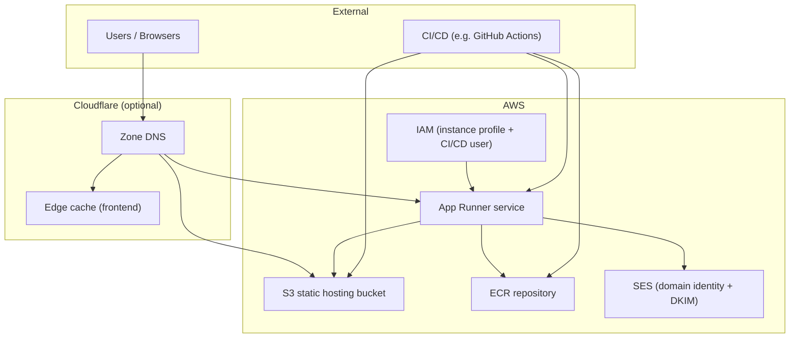
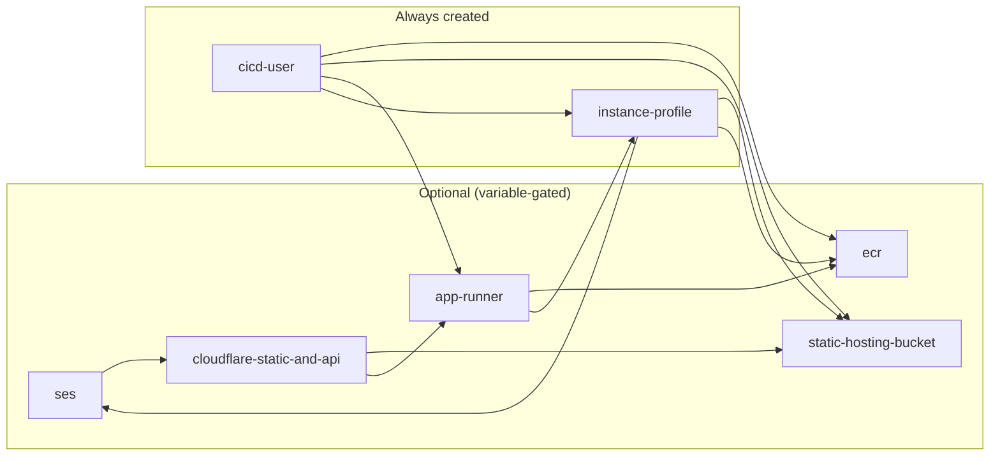
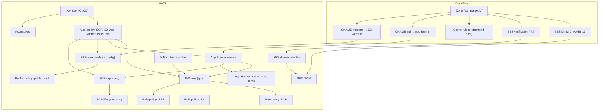
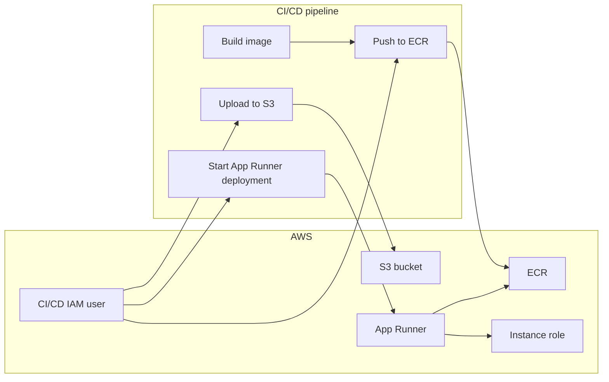
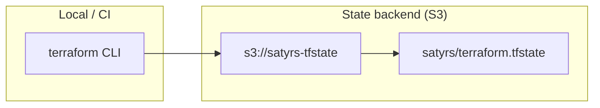

# Terraform – Satyrs M/C AWS infrastructure

This directory defines AWS resources for the Satyrs M/C project: optional S3 static hosting, optional ECR + App Runner for the API, an instance profile (SES + S3, ECR pull), and a CI/CD IAM user with minimal permissions.

---

## Topology & architecture

### High-level architecture

The stack runs in **AWS** (us-east-1 by default) with optional **Cloudflare** for DNS, caching, and optional proxying. Static assets are served from S3; the API runs on App Runner and pulls images from ECR. SES is used for sending email when enabled.



### Request flow (frontend and API)

Traffic from users hits Cloudflare first (when enabled). The frontend host (e.g. `satyrs.nynex.io`) is proxied and cached; the API host (e.g. `satyrs-api.nynex.io`) can be DNS-only or proxied. Origins are S3 website endpoint and App Runner hostname respectively.

```mermaid
sequenceDiagram
  participant U as User
  participant CF as Cloudflare
  participant S3 as S3 website
  participant AR as App Runner

  Note over U,AR: Frontend (static)
  U->>CF: GET / (frontend host)
  CF->>CF: Cache lookup (edge TTL)
  alt Cache miss
    CF->>S3: GET index.html
    S3-->>CF: 200 + content
    CF-->>U: 200 + cached
  else Cache hit
    CF-->>U: 200 (from edge)
  end

  Note over U,AR: API
  U->>CF: GET /api/... (API host)
  opt API proxied
    CF->>AR: Forward request
    AR-->>CF: Response
    CF-->>U: Response
  else API DNS-only
    U->>AR: Direct to App Runner URL
    AR-->>U: Response
  end
```

### Module dependency topology

Terraform modules and their dependencies. Optional modules are gated by variables (`create_*`, `enable_*`). The instance profile and CI/CD user always exist and are wired to whichever optional resources are created.



### Resource topology (AWS + Cloudflare)

Where each resource lives and how it connects. Arrows indicate “uses” or “points to”.



### CI/CD pipeline topology

CI uses the IAM user’s access key to push images, upload static assets, and trigger App Runner deployments. The App Runner service pulls from ECR and runs with the instance role (SES, S3, ECR pull).



### Terraform state backend

State is stored in S3; bucket and key are fixed in `backend.tf` (Terraform does not allow variables in the backend block).



---

## Prerequisites

- [Terraform](https://www.terraform.io/downloads) >= 1.0
- AWS CLI configured; profile used is set in `terraform.tfvars` (default: `brandon`)

## Backend

State is stored in S3. Bucket and key are set in `backend.tf` (literals; Terraform does not allow variables in the backend block). To change state location:

1. Edit `backend.tf` with the new bucket and key.
2. Run: `terraform init -reconfigure`

Keep `tf_state_bucket` and `tf_state_key` in `terraform.tfvars` in sync for documentation.

## Usage

```bash
# From repo root
cd terraform

# Initialize (downloads providers, configures S3 backend)
export AWS_PROFILE=brandon   # or set in terraform.tfvars and ensure profile exists
terraform init

# Plan and apply
terraform plan -var-file=terraform.tfvars
terraform apply -var-file=terraform.tfvars
```

Defaults are in `terraform.tfvars` (committed). Override with `-var` or another `.tfvars` file as needed.

## CI/CD secret

The CI/CD IAM user gets one access key. The **secret** is only available after the first apply and is stored in state. Capture it once and put it in your CI secrets (e.g. GitHub Actions):

```bash
terraform output -raw cicd_secret_access_key
```

Use `cicd_access_key_id` and this secret in CI for: pushing images to ECR, writing to the static hosting bucket, and starting App Runner deployments.

## Optional resources

Controlled by variables in `terraform.tfvars`:

- **Static hosting bucket**: `create_static_hosting_bucket`, `static_hosting_bucket_name`
- **ECR repository**: `create_ecr_repository`, `ecr_repository_name`
- **App Runner**: `create_app_runner`, `app_runner_service_name`, CPU/memory/port

Set the corresponding `create_*` to `false` to skip creating that resource.

## Adding more static hosting buckets

Use the `static-hosting-bucket` module again with a different name:

```hcl
module "static_hosting_bucket_second" {
  source = "./modules/static-hosting-bucket"

  bucket_name = "another-domain.org"
  tags        = var.tags
}
```

Then add the new bucket ARN to the instance profile and CI/CD user (e.g. via a list variable) so the app and CI can access it.
